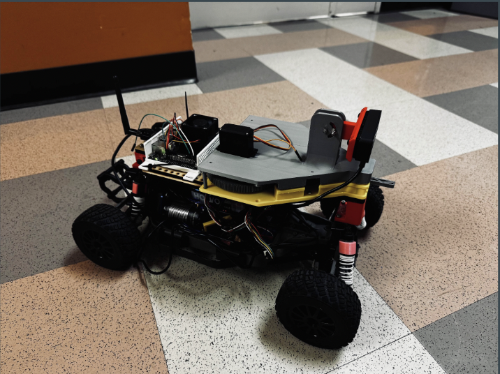

<h1 align="center">Lisence Plate Detection</h1>

  

<h4 align="center">ECE-MAE 148 Final Project</h4>
<h5 align="center">Team 10 Fall 2024</h5>

  

Table of Contents

- [Team Members](#team-members)
- [Final Project](#final-project)
  - [Original Goals](#original-goals)
    - [Goals We Met](#goals-we-met)
    - [Our Hopes and Dreams](#our-hopes-and-dreams)
      - [Stretch Goal 1](#stretch-goal-1)
      - [Stretch Goal 2](#stretch-goal-2)
  - [Final Project Documentation](#final-project-documentation)
- [Robot Design](#robot-design)
- [CAD Parts](#cad-parts)
  - [Final Assembly](#final-assembly)
  - [Custom Designed Parts](#custom-designed-parts)
  - [Open Source Parts](#open-source-parts)
- [Electronic Hardware](#electronic-hardware)
- [Software](#software)
  - [Embedded Systems](#embedded-systems)
  - [ROS2](#ros2)
  - [DonkeyCar AI](#donkeycar-ai)
- [Acknowledgments](#acknowledgments)
- [Authors](#authors)
- [Contact](#contact)

## Team Members
Sean Li (ECE) \
Ya-Lun Wu (MAE)\
Shanlin Qian (ECE)\
Chen-Min Kuan (MAE)\
Yung-Chieh Yang (ECE)

## Final Project

### Original Goals
Our project goal was to use AI to identify and read license plates of cars in a parking lot and have a mechanism to mark cars that need to receive a ticket with a sticker if the license plate is not valid.

Nice to have: 
- Have a predetermined path, recorded with GPS, that the car can follow autonomously
- Car can communicate with an external device to show users which plates have been marked

### Goals We Met

### What we could’ve improved on

#### Stretch Goal 1

#### Stretch Goal 2

## Robot Design

### CAD Parts

#### Final Assembly
Full Assembly

Assembly without Lid

#### Custom Designed Parts
| Part | CAD Model | Designer |
|------|--------------|------------|
| Base of Sticker Machine |  | Chen-Min
| Camera Mount |  | Chen-Min
| Conveyer Gear |  | Sean
| Lid of Sticker Machine |  | Chen-Min
| Pusher Rotator Link |  | Chen-Min
| Pusher |  | Chen-Min
| Rotator Gear |  | Sean
| Rotator |  | Chen-Min 
| Sticker Gear |  | Sean

#### Open Source Parts

### Electronic Hardware

### Software

#### Embedded Systems

#### ROS2

#### DonkeyCar AI

## Acknowledgments
*Thank you to my teammates, Professor Jack Silberman, and our incredible TAs and tutor for an amazing Fall 2024 class!*
## Authors

## Contact
- Sean Li |  sjl009@ucsd.edu
- Ya-Lun Wu | yaw036@ucsd.edu
- Shanlin Qian | s4qian@ucsd.edu
- Chen-Min Kuan | ckuan@ucsd.edu
- Yung-Chieh Yang | yuy043@ucsd.edu

