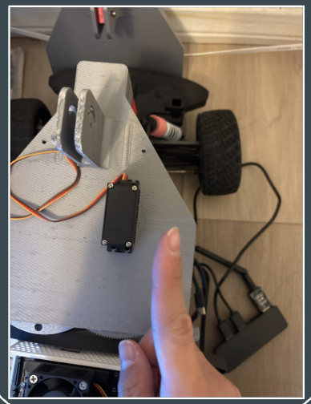

<h1 align="center">Lisence Plate Detection</h1>

  

<h4 align="center">ECE-MAE 148 Final Project</h4>
<h5 align="center">Team 10 Fall 2024</h5>

  

Table of Contents

- [Team Members](#team-members)
- [Final Project](#final-project)
  - [Original Goals](#original-goals)
    - [Goals We Met](#goals-we-met)
    - [Our Hopes and Dreams](#our-hopes-and-dreams)
      - [Stretch Goal 1](#stretch-goal-1)
      - [Stretch Goal 2](#stretch-goal-2)
  - [Final Project Documentation](#final-project-documentation)
- [Robot Design](#robot-design)
- [CAD Parts](#cad-parts)
  - [Final Assembly](#final-assembly)
  - [Custom Designed Parts](#custom-designed-parts)
  - [Open Source Parts](#open-source-parts)
- [Electronic Hardware](#electronic-hardware)
- [Software](#software)
  - [Embedded Systems](#embedded-systems)
  - [ROS2](#ros2)
  - [DonkeyCar AI](#donkeycar-ai)
- [Acknowledgments](#acknowledgments)
- [Authors](#authors)
- [Contact](#contact)

## Team Members
Sean Li (ECE) \
Ya-Lun Wu (MAE)\
Shanlin Qian (ECE)\
Chen-Min Kuan (MAE)\
Yung-Chieh Yang (ECE)

## Final Project

### Original Goals
Our project goal was to use AI to identify and read license plates of cars in a parking lot and have a mechanism to mark cars that need to receive a ticket with a sticker if the license plate is not valid.

Nice to have: 
- Have a predetermined path, recorded with GPS, that the car can follow autonomously
- Car can communicate with an external device to show users which plates have been marked

### Goals We Met
- 
### What we could’ve improved on
- Taken our time with brainstorming ideas on how to dispense stickers, so we could work with different implementations before committing to an idea
- Moving gear in the front of the sticker dispenser to help guide the conveyor belt
  - Less friction
  - More contact points between belt and gears, leading to stability
- Too much friction between the belt and unmoving edges
- Servo only runs 180 degrees, meaning we can only dispense 1 sticker at a time (We should have used a 360 degree servo in order to achieve continuous motion)
- Putting the parts together to test was difficult because of many loose parts, and inconvenience with not being able to see around the tight compartment 

## Robot Design

### CAD Parts

#### Final Assembly
Full Assembly

Assembly without Lid

#### Custom Designed Parts
| Part | CAD Model | Designer |
|------|--------------|------------|
| Base of Sticker Machine |  | Chen-Min
| Camera Mount |  | Chen-Min
| Conveyer Gear |  | Sean
| Lid of Sticker Machine |  | Chen-Min
| Pusher Rotator Link |  | Chen-Min
| Pusher |  | Chen-Min
| Rotator Gear |  | Sean
| Rotator |  | Chen-Min 
| Sticker Gear |  | Sean
| Electronic Mounting Plate |  | Chen-Min

#### Open Source Parts

| Part | CAD Model | Source |
|------|--------|-----------|
| Jetson Nano Case |  | [Thingiverse](https://www.thingiverse.com/thing:3518410) |

### Electronic Hardware
Below is a circuit diagram of the electronic hardware setup for the car.

  

### Hardware Progress
- Starting with the idea of a conveyor belt, we played around with implementing robotic arm ideas, but ultimately settled on a mechanism that combines both the ticketing and conveyor belt into one main gear. 

  

- We then began CADing our design and creating the proper gear dimensions for a belt that we ordered online.
- In order to drive the gears, we then installed a mounting bracket for a servo. 

  

- Once assembling all components on the robot, more problems began to arise because of both the fragility of certain 3-D printed components, and because of oversights in our initial designs.
- We noticed that the belt began to get caught around the sharp edges of our sticker mechanism.

  

 
- We accounted for this in a new CAD design, but did not have time to implement it into a physical model.
- Ultimately, we settled on a design where the robot would come pre-attached with a sticker on the pushing mechanism, removing the need for a conveyor belt.

  

 
- This resort still showed that our project is operable and accomplishes the original goal, but needs minor tweaks on the design to allow the conveyor belt to spin around the mechanism. 

### Software Progress

#### Open ALPR
- First we integrated OpenALPR onto our Jetson, which is an automatic number plate recognition library. 
  - Connected it to our camera, for live plate detection. 
- Then, we wrote code to match against database. 
- We initially had a code that ran continuously while the robot was driving, causing a plate number to be ticketed infinitely because the camera was not lined up perfectly with the plate. 
- We altered this code so that we now have a database with all the license plates that we are going to read, whether correct, or incorrect. Then, we checked to see if the plate we read is in the database, if it is in the database, then we will continue to check if the plate is valid or not valid. 
  - Note: this introduces the problem of having to register every possibility of license plate, which would not be applicable in real life programs; however, it helped reduce the amount of times the code ran while approaching a license plate. 
- Finally, we integrated a Arduino Nano in parallel with our Jetson to run code for our servo driving the gears for the sticker machine. 

#### DonkeyCar AI

## Acknowledgments
*Thank you to my teammates, Professor Jack Silberman, and our incredible TAs and tutor for an amazing Fall 2024 class!*
## Authors
Sean, Ya-Lun, Shanlin, Chen-Min, Yung-Chieh
## Contact
- Sean Li |  sjl009@ucsd.edu
- Ya-Lun Wu | yaw036@ucsd.edu
- Shanlin Qian | s4qian@ucsd.edu
- Chen-Min Kuan | ckuan@ucsd.edu
- Yung-Chieh Yang | yuy043@ucsd.edu

